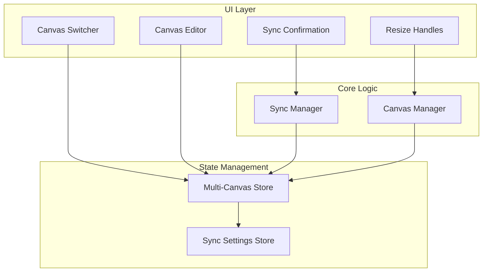

# Design Document: Multi-Canvas Template System

## Overview

本设计实现一个多画布模板同步系统，允许用户通过第一张画布（Master）建立模板，后续画布（Slave）可选择性同步修改。系统采用 React + Zustand 架构，使用 Konva 进行画布渲染。

## Architecture



## Components and Interfaces

### 1. Multi-Canvas Store (Zustand)

扩展现有 `canvasStore.js`，支持多画布状态管理。

```typescript
interface CanvasState {
  id: string
  index: number  // 0 = Master, 1-3 = Slave
  screenshot: Screenshot | null
  background: Background
  textLayers: TextLayer[]
  canvasSize: { width: number; height: number }
}

interface MultiCanvasStore {
  // 画布列表
  canvases: CanvasState[]
  activeCanvasIndex: number
  
  // 同步设置
  syncSettings: {
    batchMode: boolean
    rememberChoice: {
      background: 'sync' | 'no-sync' | null
      textStyle: 'sync' | 'no-sync' | null
      position: 'sync' | 'no-sync' | null
    }
  }
  
  // 画布操作
  addCanvas: (screenshot: Screenshot) => void
  removeCanvas: (index: number) => void
  setActiveCanvas: (index: number) => void
  updateCanvas: (index: number, updates: Partial<CanvasState>) => void
  
  // 同步操作
  syncToSlaves: (property: SyncableProperty, value: any) => void
  setSyncSettings: (settings: Partial<SyncSettings>) => void
  
  // 尺寸操作
  resizeCanvas: (width: number, height: number) => void
}
```

### 2. Canvas Switcher Component

底部画布切换器，显示所有画布缩略图。

```typescript
interface CanvasSwitcherProps {
  canvases: CanvasState[]
  activeIndex: number
  onSelect: (index: number) => void
  onDelete: (index: number) => void
}
```

**UI 设计：**
- 水平排列的缩略图卡片
- Master 画布带有 "模板" 标签和特殊边框
- 当前选中画布高亮显示
- 悬停显示删除按钮

### 3. Sync Confirmation Component

非侵入式同步确认弹窗。

```typescript
interface SyncConfirmationProps {
  message: string
  property: SyncableProperty
  onConfirm: () => void
  onDecline: () => void
  onRemember: (choice: 'sync' | 'no-sync') => void
}
```

**交互设计：**
- Toast 样式，出现在编辑元素附近
- 5 秒自动消失（默认不同步）
- 包含"记住选择"复选框
- 批量模式下不显示

### 4. Resize Handles Component

画布边角拖拽调整尺寸。

```typescript
interface ResizeHandlesProps {
  canvasSize: { width: number; height: number }
  onResize: (width: number, height: number) => void
  minSize: { width: number; height: number }
}
```

**实现方式：**
- 8 个拖拽点（四角 + 四边中点）
- 拖拽时实时更新尺寸
- 显示当前尺寸数值

## Data Models

### CanvasState

```typescript
interface CanvasState {
  id: string
  index: number
  screenshot: {
    id: string
    imageData: string
    position: { x: number; y: number }  // 百分比 0-1
    scale: number
  } | null
  background: {
    type: 'solid' | 'gradient'
    color: string
    gradient: {
      colors: string[]
      angle: number
    } | null
  }
  textLayers: Array<{
    id: string
    text: string
    position: { x: number; y: number }  // 百分比 0-1
    fontFamily: string
    fontSize: number
    color: string
    align: 'left' | 'center' | 'right'
  }>
  canvasSize: {
    width: number
    height: number
  }
}
```

### SyncableProperty

```typescript
type SyncableProperty = 
  | 'background'
  | 'textLayer.add'
  | 'textLayer.style'
  | 'textLayer.content'
  | 'textLayer.delete'
  | 'screenshot.position'
  | 'canvasSize'
```

### Text Placeholder Generator

```typescript
/**
 * 生成占位符文字，保持与原文相同的字符数
 * @param originalText - 原始文字
 * @param placeholder - 占位符字符，默认 "哈"
 * @returns 占位符文字
 */
function generatePlaceholderText(originalText: string, placeholder: string = '哈'): string {
  const charCount = originalText.length
  return placeholder.repeat(charCount)
}

// 示例：
// generatePlaceholderText("功能介绍") → "哈哈哈哈"
// generatePlaceholderText("Hello World") → "哈哈哈哈哈哈哈哈哈哈哈"
```

## Correctness Properties

*A property is a characteristic or behavior that should hold true across all valid executions of a system—essentially, a formal statement about what the system should do. Properties serve as the bridge between human-readable specifications and machine-verifiable correctness guarantees.*

### Property 1: Maximum Canvas Count Constraint
*For any* sequence of addCanvas operations, the total number of canvases SHALL never exceed 6.
**Validates: Requirements 1.4**

### Property 2: Minimum Canvas Size Constraint
*For any* resize operation with any input dimensions, the resulting canvas size SHALL be at least 200x200 pixels.
**Validates: Requirements 2.3**

### Property 3: Master Triggers Sync Confirmation
*For any* modification (background, text style, text add/delete, screenshot position) on canvas index 0 (Master), the system SHALL trigger sync confirmation (unless batch mode is enabled or choice is remembered).
**Validates: Requirements 3.1, 4.1, 4.3, 4.6, 5.1, 2.5**

### Property 4: Slave Changes Are Isolated
*For any* modification on canvas index > 0 (Slave), the system SHALL only apply the change to that specific canvas without triggering sync confirmation or affecting other canvases.
**Validates: Requirements 3.4, 4.5, 5.3**

### Property 5: Confirmed Sync Applies To All Slaves
*For any* sync confirmation that is confirmed, the system SHALL apply the identical change to all existing Slave_Canvases.
**Validates: Requirements 3.2, 4.2, 5.2**

### Property 6: Batch Mode Auto-Sync
*For any* Master_Canvas modification when batchMode is true, the change SHALL be automatically applied to all Slave_Canvases without showing Sync_Confirmation.
**Validates: Requirements 6.3**

### Property 7: Remember Choice Persistence
*For any* property type where rememberChoice is set to a value, all subsequent modifications of that same property type SHALL use the remembered choice without showing confirmation.
**Validates: Requirements 3.5**

### Property 8: Position Values Are Relative
*For any* screenshot or text layer position, the x and y values SHALL be stored as percentages (0-1 range) rather than absolute pixel values.
**Validates: Requirements 5.4**

### Property 9: Auto-Dismiss Defaults To No Sync
*For any* Sync_Confirmation that auto-dismisses after timeout without user action, the system SHALL NOT apply the change to any Slave_Canvas.
**Validates: Requirements 6.2**

### Property 10: Canvas State Serialization Round-Trip
*For any* valid multi-canvas state, serializing (exportState) then deserializing (importState) SHALL produce an equivalent state.
**Validates: Requirements 7.1**

### Property 11: Canvas Deletion Re-indexes Correctly
*For any* canvas deletion operation, the remaining canvases SHALL have sequential indices starting from 0, and the first canvas SHALL remain the Master.
**Validates: Requirements 1.5, 1.6**

### Property 12: Text Content Sync Creates Placeholder
*For any* text content sync from Master_Canvas to Slave_Canvases, the synced text SHALL have the same character count as the original but filled with placeholder characters (e.g., "哈").
**Validates: Requirements 4.4, 4.5**

## Error Handling

### Canvas Operations
- **Max canvas reached**: 显示 toast 提示 "最多支持 4 张画布"
- **Delete last canvas**: 禁用删除按钮，保留至少 1 张画布
- **Invalid image upload**: 显示错误提示，不创建画布

### Resize Operations
- **Below minimum size**: 限制在 200x200，显示尺寸提示
- **Drag outside viewport**: 限制拖拽范围

### Sync Operations
- **Sync to empty canvas**: 跳过没有截图的画布
- **Text layer ID mismatch**: 使用位置匹配而非 ID 匹配

## Testing Strategy

### Unit Tests
- Canvas store 状态管理逻辑
- Sync manager 同步决策逻辑
- Resize 边界值处理

### Property-Based Tests
使用 fast-check 库进行属性测试，每个测试至少运行 100 次迭代：

1. **Property 1 Test - Max Canvas Count**: 生成随机 addCanvas 操作序列，验证画布数量永不超过 6
   - **Feature: multi-canvas-template, Property 1: Maximum Canvas Count Constraint**

2. **Property 2 Test - Min Canvas Size**: 生成随机尺寸值（包括负数和极小值），验证结果始终 >= 200x200
   - **Feature: multi-canvas-template, Property 2: Minimum Canvas Size Constraint**

3. **Property 3 Test - Master Triggers Sync**: 生成随机修改操作，验证只有 index=0 时触发同步确认
   - **Feature: multi-canvas-template, Property 3: Master Triggers Sync Confirmation**

4. **Property 4 Test - Slave Isolation**: 生成随机 Slave 修改操作，验证不影响其他画布
   - **Feature: multi-canvas-template, Property 4: Slave Changes Are Isolated**

5. **Property 8 Test - Relative Position**: 生成随机位置值，验证存储值始终在 0-1 范围
   - **Feature: multi-canvas-template, Property 8: Position Values Are Relative**

6. **Property 10 Test - State Round-Trip**: 生成随机画布状态，验证序列化/反序列化后等价
   - **Feature: multi-canvas-template, Property 10: Canvas State Serialization Round-Trip**

### Integration Tests
- 完整的多画布创建-编辑-同步-导出流程
- 同步确认交互流程
- 画布切换状态保持
